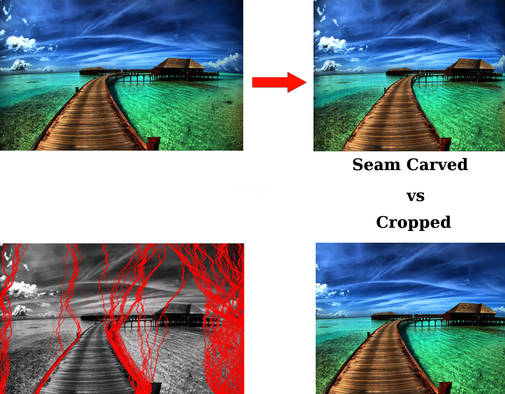

# spis15-project-Graphics-Chris-Harley
As of September 3, 2015, we've completed our project. It uses a GUI, and
can be run from any system which has python installed (with the modules
Tkinter and PIL as well). To run it, ensure you have python installed with
the required modules, and clone our repository:

    git clone git@github.com:chris1625/spis15-project-Graphics-Chris-Harley.git

Enter the directory from a terminal or command prompt, and use the 
following command to start our program:

    python tk.py

Once there, follow the on-screen instructions to use our seam-carving
program. As of now, it is quite buggy and will not produce a perfect
result. Output of the program can be found in the directory as output.bmp.
You can view the seams in the image in seamsH.jpg and seamsW.jpg as well.

Example images:

We are currently working on a better version of this program, which will
produce better results. Consult test_carving.py for updates on that 
progress.
